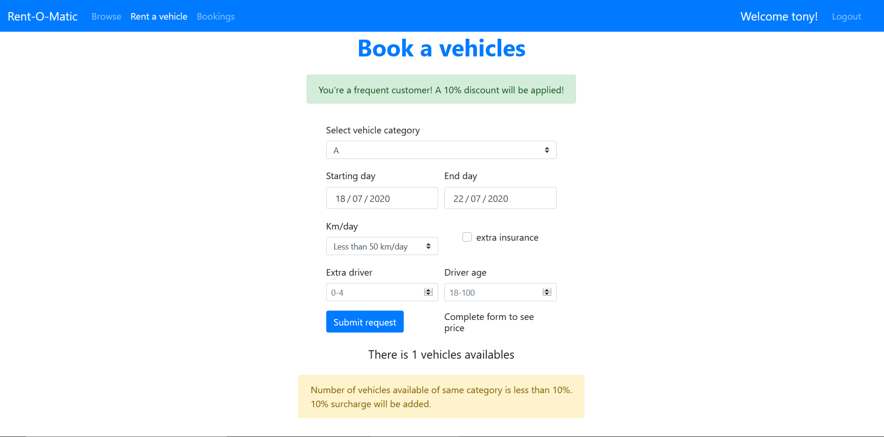

# Car Rental WebApp
## Student: CHETTA COSIMO 

## Introduction

Built with React, this WebApp application allows you to rent vehicles
from a predefined list, check your bookings or simply browse the vehicles.
Unahuthenticated users are only able to browse the vehicles list. 
Once authenticated users can access a configuration page, where they
can set parameters for their new rental. The vehicle is choosen randomly
from all avaible ones that meet the parameters.
They payment is not fully implemented and supported by a stub API.

## Setup
To run the project:

- clone it
- run two different terminal, one for the client and one for the server
- terminal 1: cd client; npm install; npm start
- terminal 2: cd server; npm install; nodemon server.js

### Test users

| mail | password | frequent |
| ----------------- | ------- | --- |
| aldo@mail.com     | baglio  | no  |
| giovanni@mail.com | storti  | no  |
| giacomo@mail.com  | poretti | no  |
| tony@mail.com     | stark   | yes |
| peter@mail.com    | parker  | no  |

## Description

### React client application routes

- Route `/browse`: Browse vehicles list
- Route `/login`: Login page
- Route `/config`: Authenticated user can configure his rental
- Route `/payment`: 
- Route `/bookings`: Show future bookings and past rentals

### REST API server

- POST `/api/login`
  - request body: email, password
  - response body: user_id, name
  - response cookie: user_id, jwtSecret
- POST `/api/logout`
  - response body: empty
- GET `/api/vehicles`
  - request parameters: category, brand
  - response body: vehicles list
- GET `/api/user`
  - request cookie: user
  - response body: id, name
- GET `/api/past`
  - request body: user_id
  - response body: list of past rentals
- GET `/api/future`
  - request body: user_id
  - response body: list of future rentals
- GET `/api/isfrequent`
  - response body: number of past rents of logged user
- GET `/api/available`
  - request parameters: category, start, end
  - response body: number of vehicle of a specific category available in start to end days
- POST `/api/payment`
  - request body: name, surname, card_number, CVV
  - response body: empty
- POST `/api/rent`
  - request body: rent object
  - response body: id of new rent created
- DELETE `api/rent/:rentId`
  - response body: empty

### Server database

- Table `users` - id, username, email, hash
- Table `vehicles` - id, category, brand, model
- Table `rents` - contains id, user, vehicle, starting_day, end_day, cost, km, driver_age, extra_driver, category, extra_insurance

### Main React Components

- `Browse` (in `Browse.js`): show vehicles list and filters
- `Filters` (in `Filters.js`): filter list of vehicles
- `Header` (in `Header.js`): Header with links to different routes
- `ConfigureForm` (in `ConfigureForm.js`): configurator to rent a vehicle
- `PaymentForm` (in `PaymentForm.js`): payment form to submit a rent
- `LoginForm` (in `LoginForm.js`): Login page

